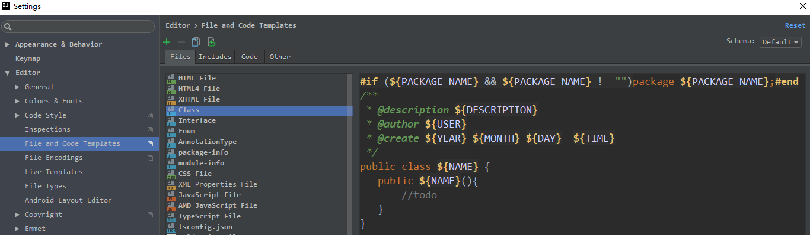
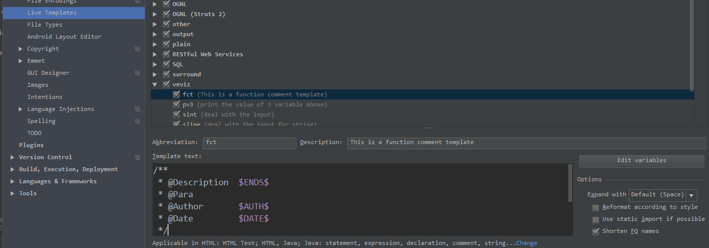

# 文件代码模版使用
## 文件代码模版
文件代码模版在idea的settings-->Editor-->file and code templates处可以进行设置和更改。文件代码
模版可以简单理解为，在new一个新的文件刚开始，写入该文件中的内容。  
比如，在写Java程序的时候，新建一个class文件，每个程序员都喜欢给该文件加入一些注释或描述，以及
署上自己的大名。但是，每次都自己手动敲还是比较麻烦。

我们对class文件的模版进行修改，
```vtl
   #if (${PACKAGE_NAME} && ${PACKAGE_NAME} != "")package ${PACKAGE_NAME};#end
   /**
    * @description ${DESCRIPTION}
    * @author ${USER}
    * @create ${YEAR}-${MONTH}-${DAY}  ${TIME}
    */
   public class ${NAME} {
      public ${NAME}(){
          //todo
      }
   }

```
这一段代码输入`vtl`的语法，不过也很好理解。第一句使用`#if`和`#end`，表示如果该文件的package存在
且不为空字符，则需要在文件开头包括该package。  
后面的一段用注释括起来的内容，是程序员自定义的，用来写一些文件信息。  
最后才是正文内容。其中，我自己加了一个无参构造函数。当我们需要用到一个固定值的自定义变量的时候
并且该变量多个地方被引用，我们可以通过 VTL 语法的 `#set( $变量名 = "变量值内容" );` 来设置。
当然，idea给我们提供了许多类型文件的文件代码模版，我们都可以对其进行更改和设置。如果某个类型文件
没有文件代码模版，我们也可以新建一个。
## 注释代码模版
在idea中，没有像eclipse中的`comment template`，所有关于模版的地方只有两处，分别为实时模版
和文件代码模版。不过，我们可以自定义一个实时模版，作为我们的注释代码模版。

定义了一个fct，表示函数注释模版，在每个函数的函数体前面加上这段注释。