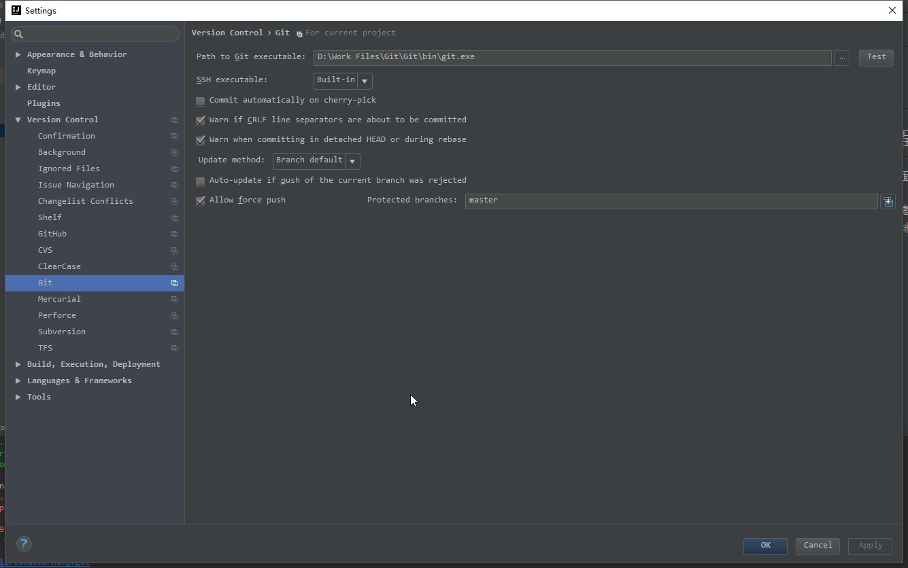
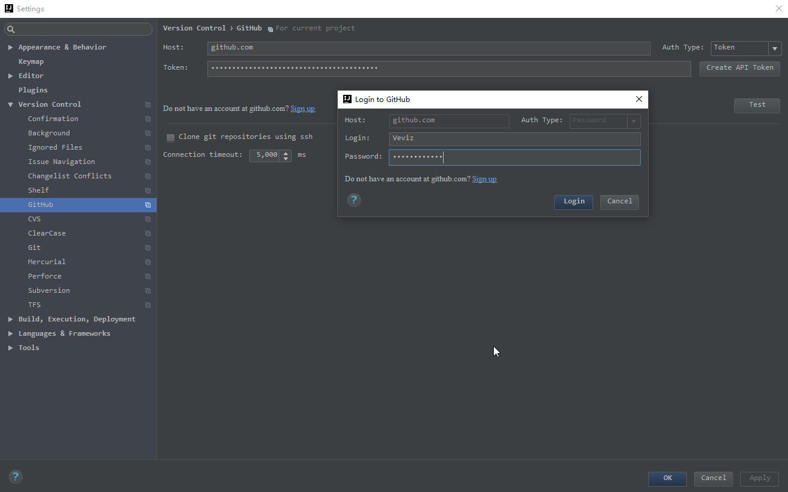
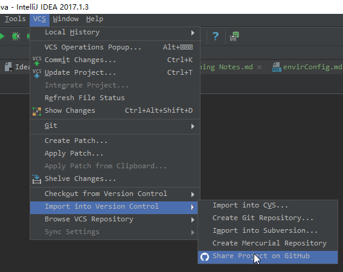
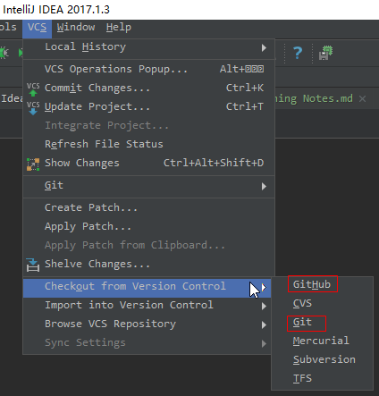
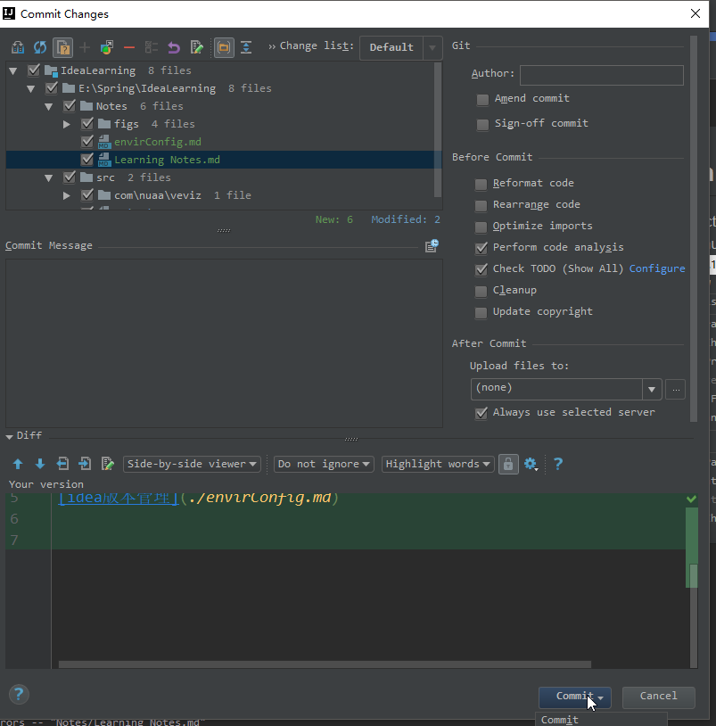
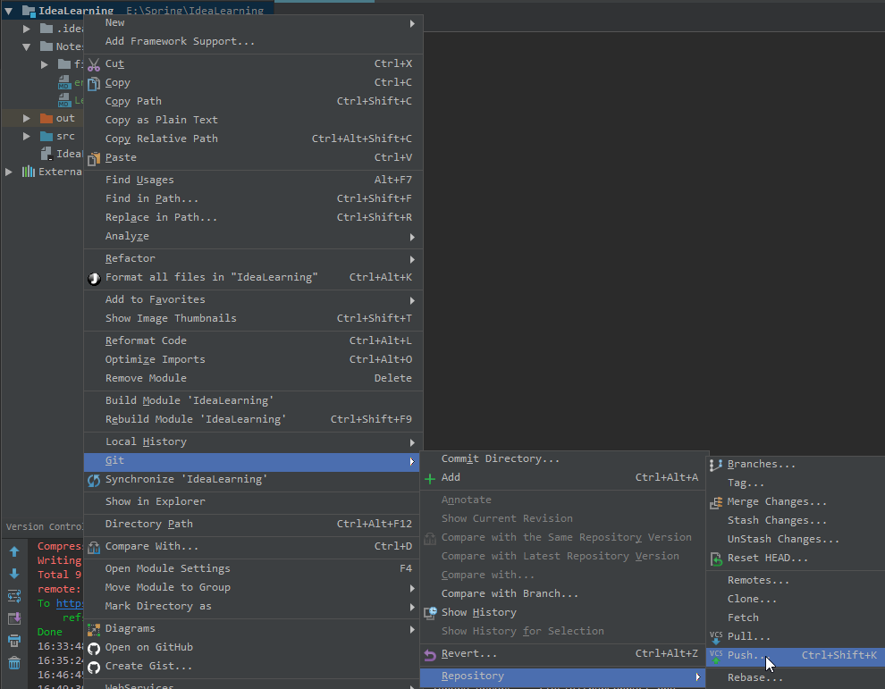

# idea 版本管理
由于对github情有独钟，因此选择使用github进行版本管理。
## 1. 环境配置
安装配置git，并且在github上面申请一个帐号，这些基本工作通过百度就可以完成。  
然后需要对idea进行稍微配置。通过快捷键 `ctrl+alt+s` 打开settings界面，选择Version Control-->
Git，在该界面填写本地安装的git.exe文件的目录，如下图所示。  

然后选择Version Control-->Github，在该界面需要填写自己的github帐号和密码，并测试连接：

## 2. 推送到github  
在本地新建一个project，用于本地编辑和编译。由于需要版本控制，需要将本地的project存放在github
上。选择VCS--> import into version control --> share project on github:

## 3. 从github上clone
本地没有project，需要从github上clone一个project，选择VCS--> checkout from version control -->
Github / Git (都行)

选择github选项的话，有一个下拉框，可以从你的github任选一个repository进行clone；如果选择git选项
，则需要自己手动输入确切的repository的路径。一般建议选择github选项。

## 4. 对github进行更新
在本地进行project的编辑和编译之后，需要将所有的更新操作提交到github中的仓库中，和普通的git一样，需要三个
步骤：`git add`、`git commit`以及`git push`.
1. `git add：` 将做出的改变增加到本地库中，我们可以直接使用快捷键：`ctrl+alt+A`;  
2. `git commit：`对自己提交的更改进行确认，并填写一句话，说明更改的内容，没有快捷键，右键project选择
git-->commit directory...，然后进入下面的界面：
  
我们可以在*commit message*编辑框中填写更新的内容或者标签，然后点击commit即可。
3. `git push：`将提交的更改推送到github中去的最后一步，我们有快捷键：`ctrl+shift+K`.或者通过鼠标
右键project-->git-->Repository-->Push.

