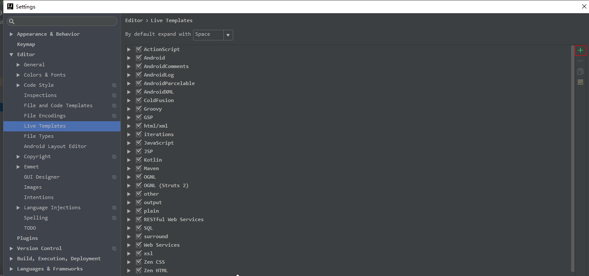
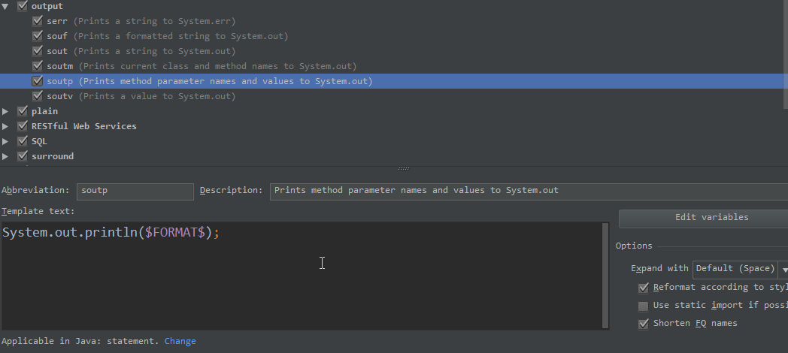
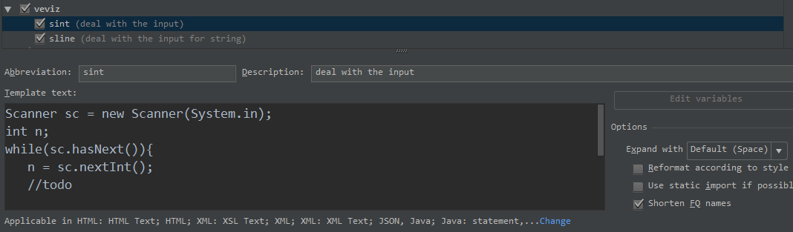
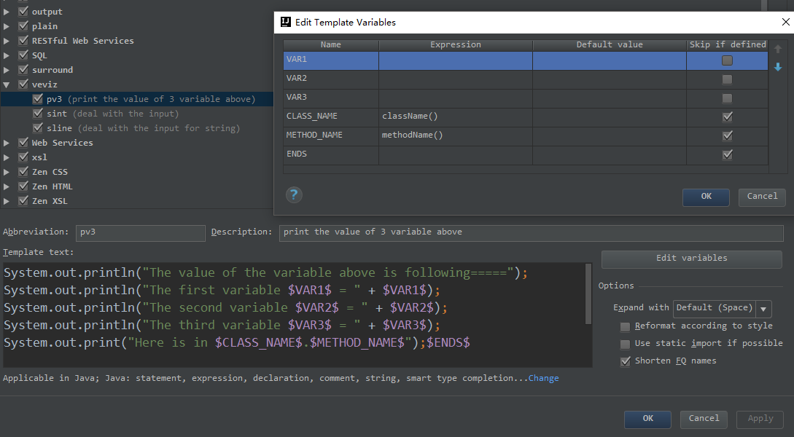

# idea实时模版
idea提供的实时模版，官网为：https://www.jetbrains.com/help/idea/live-templates.html。
实时模版可以通过几个简单的字母代表一连串的代码，我们只需要记忆这些简单的字母组合，
并在编程的时候敲出这些字母，idea就会立马帮你将其代表的一连串代码显示出来。在写程序的时候，
能够极大地提升我们的编程效率。
## 1. 系统自带模版
这些模版是系统已经给我们提供的代码模版。当然我们也可以进行更改，也可以直接去记忆并使用就好。
系统提供的自带模版种类比较多，对于单纯写Java  Web的程序，可能有很多模版我们并不会用到。

上图显示的是各个实时模版的分组情况，比如output组中都是输出的各种模版：

该组中不仅有多个模版对应的命令，还显示了该命令对应的代码段，以及解释等。我们可以对其尽心个修改
，但大部分时候，我们记住就好。

---

## 2.自定义模版
 当我们在编写一个project的时候，某些代码可能会应用多次，直接复制粘贴并不是最理想的法方法。
 一个比较好的选择就是自定义一个实时模版。
 我们给自定义的模版加一个组，叫做`veviz`。在该组中，都是我们自定义的模版。
 比如，当我们在[leetcode](https://leetcode.com/problemset/algorithms/)或者
 [牛课网](https://www.nowcoder.com/activity/oj)上面刷题的时候，我们需要手动处理输入，基本都
 需要写入一段固定的代码，作为输入的处理，我们便可以自定义一个模版：  
 ```
         Scanner sc = new Scanner(System.in);
         int n;
         while(sc.hasNext()){
            n = sc.nextInt();
            //todo
              
         }
```
并给起命名为`sint`，表示`scan`输入到`int`类型的变量中。  

定义好自己的模版之后，在程序中，当我们输入`sint`并输入空格之后，上述的代码段就会写入到程序中。

## 3. 自带变量参数
在idea的编译环境中，idea的实时代码模版中是可以带有参数的。其中IntelliJ IDEA自带了两个参数变量：
> $END$，表示最后都编辑完后光标所处的位置  
> $SELECTION$，表示设置环绕实时代码模板。  
> 除了上面两个变量参数外，其他一律都会自定义变量。

其中官网的介绍如：https://www.jetbrains.com/help/idea/live-template-variables.html
对于自定义的变量，我们需要给变量设置一个变量名，然后映射一个表达式，如图所示：  

可以看出，每一个变量名可以对应一个表达式，其中可以选择一个内置函数。内置函数的介绍可以参考：
https://www.jetbrains.com/idea/help/live-template-variables.html。在代码中，我们可以通过
`tab`键在不同的变量之间跳转。如果你不想下一个`tab`键跳转到该变量上，可以选择`skip if defined`。

idea的实时模版是在你写程序的过程中不断增加的，而不是提前预设的。只有当你遇到这样的需求的时候，
使用实时模版才是最佳选择。